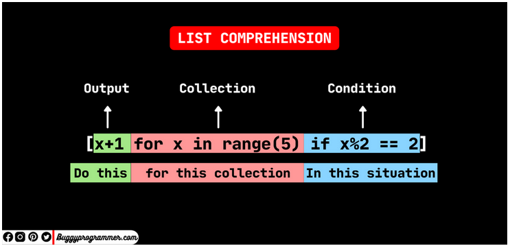

# List comprehesions

Las List comprehesions son la manera más elegante de escribir una lista iterable en Pyhton.

Por lo general es una sola línea que encierra el código en "[]"
Se puede usar para filtrar, formatear, modificar y todo lo que se puede hacer con la iteración. Para funcionar necesita estos 3 componentes
1. ciclo for
2. condición y expresion
3. output



### Ejemplos
Reocrrer los valores del 1st al último
```python
1st = [1,2,3,4,5,6,7,8,9,10]

a = [x for x in 1st]
print(a)

#output
[1,2,3,4,5,6,7,8,9,10]
```
El equivalente sería ese
```python
for x in 1st:
    a.append(x)
```
Nos damos cuenta que ya no estamos necesitando append en nuestra lista.

Podemos usar list comprehesions para modificar cualquier elemento en *1st*
```python3
# add any number to every elements of lst and store it in a
a = [x+1 for x in lst]
 
# subtract any number to every elements of lst and store it in a
a = [x-1 for x in lst]
 
# multiply any number to every elements of lst and store it in a
a = [x*2 for x in lst]
```
### List Comprehesions with Single and Nested if condition
Podemos usar if para ayudarnos a filtrar data, por ejemplo. En el siguiente código estamos guardando todos los valores 1st en lsta c los valores que sean mayores que 4
```python3
lst = [1,2,3,4,5,6,7,8,9,10]
#con la condición if
c = [x for x in 1st if x > 4]
print(c)

#output
[5,6,7,8,9,10]
```
El equivalente sería
```python
for x in 1st:
    if x > 4:
        a.append(x)
```
 ### List Comprehesions with Single and Multiple If and Else Conditions

  Se le puede añadir múltiples if a estas listas
  ``` python3
  1st = [1,2,3,4,5,6,7,8,9,10]
  #con if condition
  e = [x if x > 4 else "less than 4" for x in 1st]
  #output
  ['less than 4', 'less than 4', 'less than 4', 'less than 4', 5, 6, 7, 8, 9, 10]
  ```

Esto serpia equivalente a:
```python
for x in 1st:
    if x > 4:
        d.append(x)
    else:
        d.append("less than 4")
```
Ahora, en el ejemplo de abajo habrá una list comprehesion con multiples *if and else*.
Vamos a almacenar en el string "Dos" si el valor es divisible por dos, "tres" si el valor es divisile por 3, lo demás estará almacenado en el valor "no 2 ni 3"

```python
f = ["Two" if x%2 else "Three" if x%3 == 0 else "not 2 & 3" for x in 1st  ]
print(f)
#output
['not 2 & 3', 'Two', 'Three', 'Two', 'not 2 & 3', 'Two', 'not 2 & 3', 'Two', 'Three', 'Two']
```
Esto funciona porque se divide toda la condicipon por 3 donde, después de cada else
```python
'Two' if x%2 == 0 else "Three" if x%3 == 0 else 'not 2 & 3'
```
si la primer condición if es true, tomarpa el valor de "Two", de no ser así se moverá a la segunda condición if, que guardará cualquier valor, como la condición elif.

Para la segunda condición if, guardará el valor "Three" si la condición resulta ser ciert. De lo contrario, va a revisar la siguiente condición, la cual no tenemos. Así que cualquieraque sea el valor que venga después del else, va a ser guardado, lo cual es el string "not 2 & 3".

la manera tradicional sería:

```python3