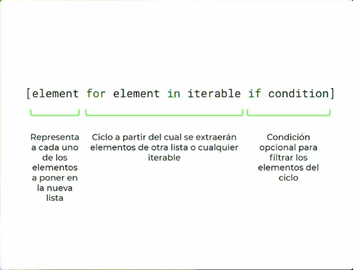

# List comprehesions
>generar listas sin ciclos
```python
def run():
    # squares = []

    # for i in range(1, 101):
    #     if i % 3 != 0:
    #         squares.append(i**2)

    squares = [i**2 for i in range(1, 101) if i % 3 != 0]
    
    print(squares)


if __name__ == "__main__":
    run()
``` 


```python
[element for element in iterable if condition]
#El element representa a cada uno de los elementos a poner en la nueva lista
``` 
1. En elements representa a cada uno de los elementos a poner en la nueva lista
2. del < for elements in iterable >, el ciclo a partir del cual se extraerá elementos qde otra lista o cualqueier iterable.
3. < if condition> condición opcional para filtrar elementos del ciclo

```python
[i**2 for in range(1,101) if i % 3 !=0]
``` 
>para cada i de los números del 1 al 100 voy a guardar esa i al cuadtrado solamente si no es divisible por 3

* ***reto***
* crer, con un list comprehesion, una lista de todos los múltiplos de 4 que a la vez también son múltiplos de 6 y de 9, hasta llegar a los 5 digitos
  
```python
def run():
    my_list = [i for in range(1, 10000) if i % 4 == 0 and i % 6 == 0 and i % 9 == 0]
    print(my_list)

if __name__ == '__main__':
    run()
```