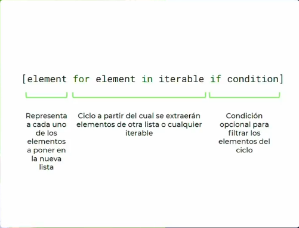

# Listas y diccionarios anidados
## Importante
aprender a usar el *.gitignore*
para ignorar la carpeta, dentro del archivo git ignore, solo tenemos que escribir el nombre de las cosas que queremos ignorar.
>las listas son una manera de organizar objetos y los dicionaros también pero con un formato llave y valor

* las listas pueden guardar diccionarios porque son objetos en python y los diccionarios pueden almacenar listas.
    * se pueden tener listas que almacenen diccionarios  y diccionarios que almacenen listas

```python
def run():
    my_list = [1, "hello", True, 4.5]
    my_dict = {"firstname":"Carlos", "lastname":"Lara"} 

    super_list = [
        #lista de diccionario
        {"firstname":"Carlos", "lastname":"Lara"},
        {"firstname":"JOse", "lastname":"Jose"},
        {"firstname":"Benito", "lastname":"Maradona"},
    ]

    super_dict = {
        #diccionario de listas
        "natural_nums": [1,2,3,4,5],
        "integer_nums":[-1,-2,0,1,2],
        "floating_nums":[1.1, 4.5, 6.43],
    }

    for key, value in super_dict.items():
        print(key,"-",value)

if __name__ == '__main__':
    run()

``` 
