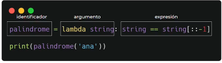
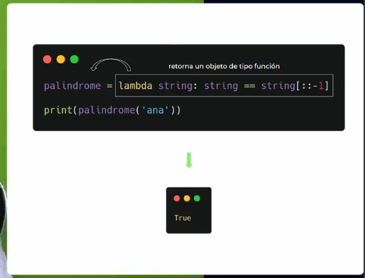

# Conceptos avanzados de funciones
Una función es simplemente código que escribimos una vez y aplicamos después en diferentes lugares donde estemos trabajando.

## funciones anónimas: Lambda

Lambda son las funciones anónimas que contienen una sola expresión, es decir: funciones sin identificación, sin nombre:

```python
lambda argumento:expresión
```
* tenemos la palabra clave *lambda*
* un argumento seguido de una expresión donde se colocan los argumentos

En vez de usar *def* usamos *lambda*. Estas últimas pueden tener el argumento que nosotros necesitemos, pero una sola línea de expresión.

```python
palindrome = lambda string: string === string[::-1]
print(palindrome("ana"))
#output
True
```

1. argumento o parametro que recibe la función para poder  acompañado de la palabra clave lambda
2. expresión con linea de código
3. variable con identificador, *ojo* no es de la función, sino de la variable que va a contener un objeto de tipo función que retorna toda la función de python



* retorna un objeto tipo función. además de ser anónima, para llamarlo, pero el nombre que va a tener esta función con el que se le va a llamar después es la variable de tipo función.
con funciones normales se vería:

```python
def palindrome(string):
    return string == strig[::-1]
print(palindrome("ana"))
#output
True
```
>pongo el código otra vez para comparar

```python
palindrome = lambda string: string === string[::-1]
print(palindrome("ana"))
#output
True
```

| lamda    | def   |
| ---------| ------|
|parametro sin paréntesis | parametro con parentesis|
| usar lambda   | usar def  |
| sin parentesis    | entre parentesis |
| identificador como nombre de la variable | identificador como nombre de la funcion
| sin return | palabra return |

---

## High order functions: filter, map y reduce
Una función de order superior es una función que recibe como parametro a otra función.

Además tiene una serie de carácterísticas especiales.

```python
def saludo(func):
    func()

def hola():
    print("hola!!!")

def adios():
    print("adiós")

saludo(hola)
saludo(adios)
```
* *cuando nosotros llamamos a saludo; saludo recibe la función como paramétro y ejecuta dentro de si misma*
* *por lo tanto, si a saludo, le pasamos como parametro la función "hola" el resultado será hola en consola*

Hay tres funciones de orden superior que son importantes en una gran cantidad de lenguajes de programación. son: ***filter, map y reduce***

### filter()

Se usa para los elementos que queremos filtrar.

***Ejemplo con comprehesion***:
```python
my_list = [1,4,5,6,9,13,19,21]
odd = [i for i in my_list if i % 2 != 0]
print(odd)

#output
[1,5,9,13,19,21]
```
así se resuelve con filter:
```python
my_list = [1,4,5,6,9,13,19,21]
odd = list(filter(lambda x: x%2 !=0, my_list))
print(odd)
```
Analicemos:
1. lambda recibe como parametro una x y retorna el resultado de la expresión x%2 !=0
2. recibe un número y retorna true o false si ese número par o impar
3. filter recibe dos parametros; una función (en este caso lambda) y un iterable


### 2. map()
Transforma transforma la lista en la misma pero en una modificación

este es un ejemplo con list comprehesions
```python
my_list = [1,2,3,4,5]
squares = [i**2 for i in my_list]
print(squares)
```